# BD: Trabalho Prático APF-T

**Grupo**: P3G2

- Marco Almeida, MEC: 103440
- Rui Machado, MEC: 65081

## Introdução

Este projecto foi realizado no âmbito da unidade curricular de Bases de Dados, pertencente à Licenciatura em Engenharia de Computadores e Infomática.
O objectivo deste trabalho consistiu na implementação de um sistema suportado por uma base de dados com uma complexidadee semelhante à encontrada no mundo real.
O nosso grupo optou por desenvolver um sistema informático para uma cadeia de Stands Automóveis, que além de gerir o inventário e rescursos humanos, também seria utilizado para registar as operações de negócio. Escolhemos este tema pelo facto de termos alguma experiência com esse tipo de sistemas, o que nos permitiu modelar o projecto de forma realista e alcançar um nível de complexidade adequado.

## ​Análise de Requisitos

O projeto visa modelar um sistema de gestão duma cadeia internacional de Stands/Oficinas Automóveis.

- Existem vários stands automóveis espalhados por vários países. Cada stand possui um ID único, um endereço e informações de contacto. Cada stand é responsável pela gestão dos seus funcionários, veículos e peças em stock.

- Cada funcionário possui um ID único, nome, e-mail, contacto telefónico e pertence exclusivamente a um stand. OS funcionários podem ser vendedores, mecânicos ou gerentes. Em cada stand, há apenas um gerente.

- Um veículo possui atributos como matrícula, marca, modelo, ano de fabrico, tipo de combustível, condição(usado/novo), quilómetros percorridos, cilindrada, potência(cv) e tipo de caixa (manual/automática).

- Os veículos podem ser carros ou motas. Os carros possuem atributos adicionais como número de portas e número de lugares.

- As peças têm uma designação, categoria e subcategoria. Além disso, o sistema controla a quantidade de peças em cada stand.

- O sistema também guarda um registo dos seus clientes. Os clientes são identificados pelo número de identificação fiscal (NIF), nome, e-mail e telefone.

- Os stands oferecem serviços de compra/venda de automóveis, reparação (com oficinas e mecânicos próprios), venda de peças e aluguer de automóveis.

- Os stands também fazem operações internas de importação de automóveis e importação de peças.

- O sistema regista todas as operações de negócio.

## DER - Diagrama Entidade Relacionamento

### Versão final/Final version

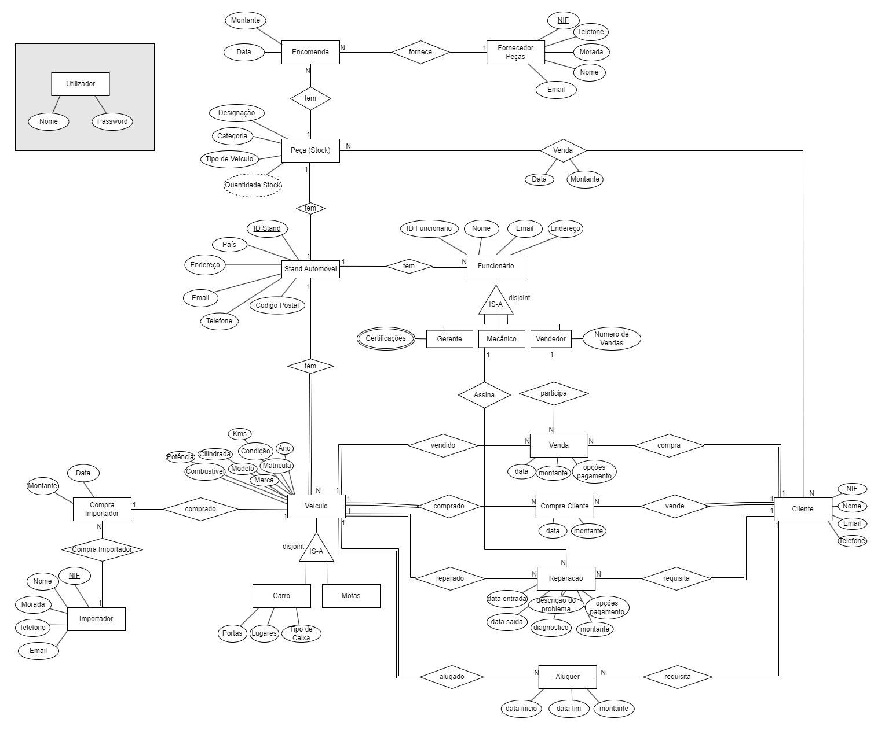

## ER - Esquema Relacional

### Versão final

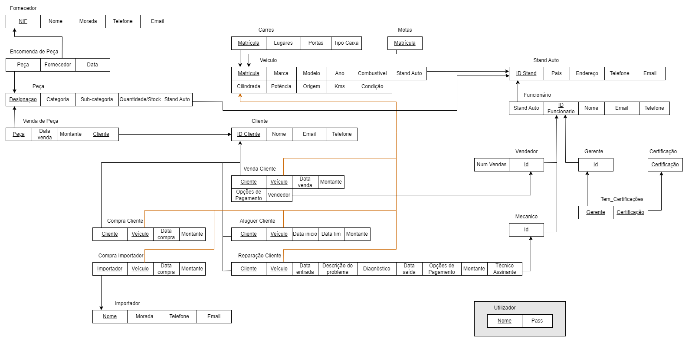

### APFE

- Adicionámos uma tabela de Utilizador para as funcionalidades de Login e Registo.
- Adicionámos colunas de identificação autoincrementadas a algumas tabelas.

## ​SQL DDL - Data Definition Language

[SQL DDL File](../source/SQL_Scripts/SQL_DDL.sql "DDL")

## Forms

<br>
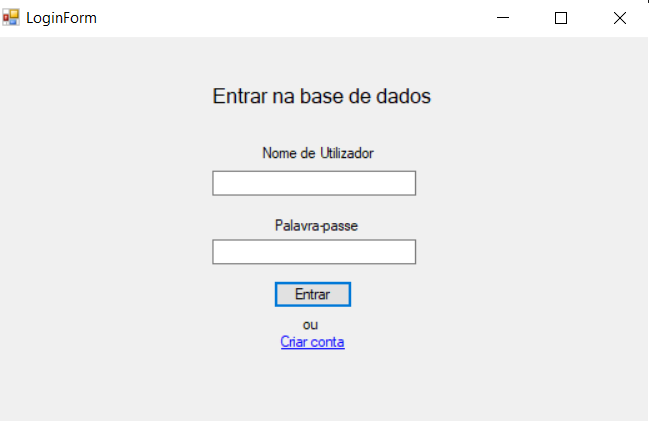
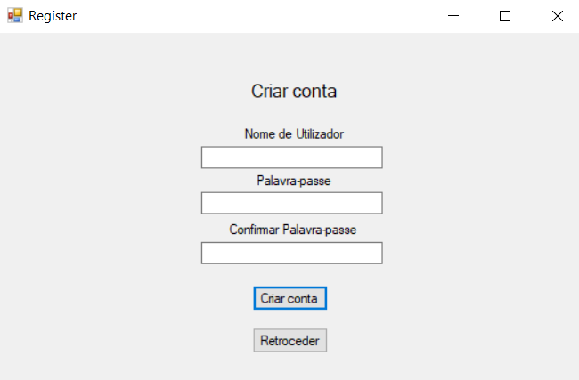
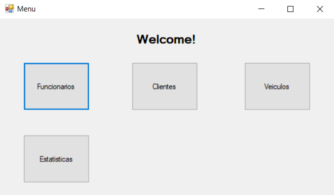
<br>
Com este projeto, optamos por desenvolver um sistema que simula uma aplicação real, para isso implementamos diversos formulários interligados.
Implementámos as funcionalidades de <b>Login</b> e <b>Registo</b> e um <b>Menu</b> de entrada. As palavras-passe são armazenadas na base de dados depois de transformadas por hash, para garantir a segurança dos utilizadores.
O menu oferece as seguintes possibilidades:<br>

<b>-Funcionários:</b> um componente destinado a ser utilizado pelo setor de Recursos Humanos para gerir os funcionários da empresa.<br>
<b>-Clientes:</b> permite aos funcionários vendedores e mecânicos registar novos clientes.<br>
<b>-Estatísticas:</b> um componente onde o gerente e os vendedores podem acompanhar o desempenho das vendas.<br>
<b>-Veículos:</b> um menu secundário com opções relacionadas aos negócios.<br>

### Formulario dos Funcionários

<br>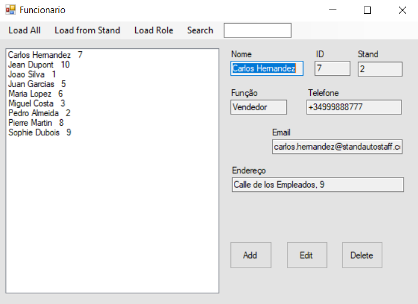<br>

Na secção dos Funcionários, o utilizador pode visualizar todos os funcionários da empresa, filtrá-los por Stand ou por cargo. Além disso, foi implementada uma função de pesquisa que permite encontrar funcionários pelo nome. Nesta parte da aplicação, o utilizador tem a capacidade de adicionar, editar ou eliminar funcionários.
Para a eliminação de funcionários, foi implementada uma Stored Procedure que remove o funcionário de todas as tabelas, exceto nos registros de operações, como vendas e reparações.
<br>

### Formulario dos Clientes

<br>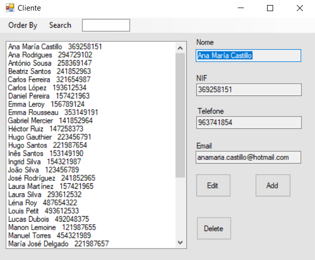<br>

Na secção dos Clientes, o utilizador tem a capacidade de visualizar todos os clientes registados, podendo escolher a forma como são apresentados, seja alfabeticamente ou ordenados pelo NIF. Além disso, é disponibilizada uma função de pesquisa semelhante à dos funcionários. Nesta página, o utilizador tem a opção de adicionar, editar ou eliminar clientes.
<br>

```sql
SELECT * FROM Cliente ORDER by nome; -- Show data on the form

INSERT Cliente VALUES (@NIF, @Nome, @Telefone, @Email) ; -- Insert new element

UPDATE Cliente SET nome = @Nome, email = @Email, telefone = @Telefone WHERE nif = @NIF --Update element

DELETE Cliente WHERE NIF=@nif; -- Delete element
```

### Menu de Veículos/Operações de Negócio

<br>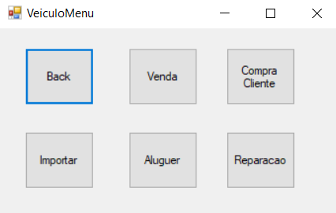<br>

Esta componente da aplicação é a que seria mais utilizada no dia-a-dia dos funcionários, onde eles podem registar as operações do Stand:
-Venda a Cliente<br>
-Compra a Cliente<br>
-Importação<br>
-Aluguer<br>
-Reparação<br>

<br>
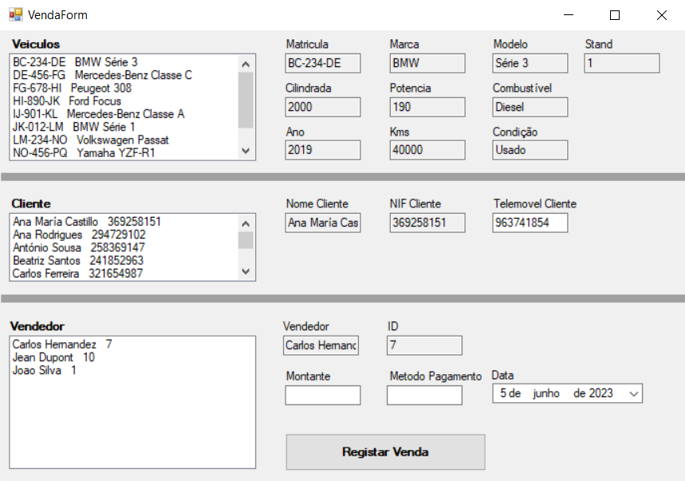
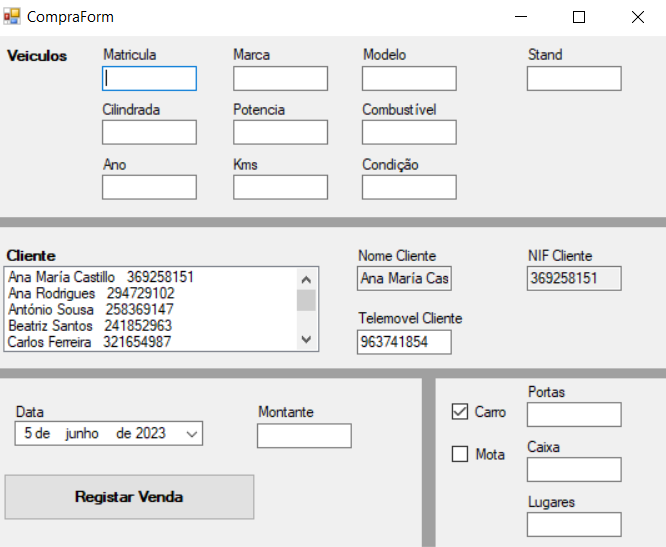
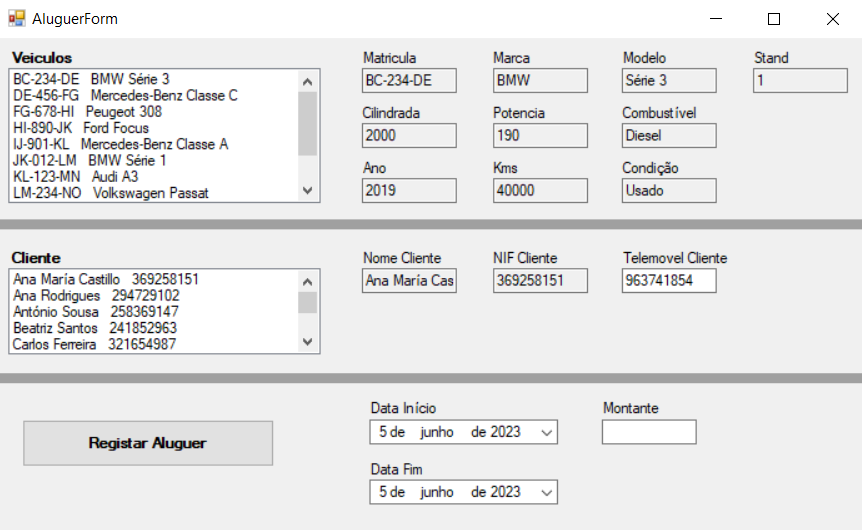
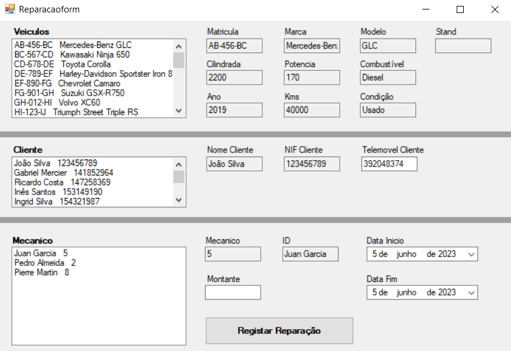
<br>

Para esta parte do projecto impleméntámos várias SPs (com transactions), Triggers, Views e UDFs.<br>
Por exemplo, ao realizar a compra de um veículo a um cliente particular, o sistema deve ser capaz de inserir o veículo na tabela de Veículos. Adicionalmente, deve inserir o veículo na tabela de Carros ou Motas e registar a transação de compra.
O sistema também possibilita a modificação do contacto telefónico do cliente sem necessidade de aceder ao formulário de clientes, uma vez que é esperado que seja frequentemente alterado.

```sql
CREATE PROCEDURE BuyClientVeiculo @matricula VARCHAR(20), @marca VARCHAR(30), @modelo VARCHAR(255), @combustivel VARCHAR(30), @potencia INTEGER, @cilindrada INTEGER, @ano INTEGER, @quilometros INTEGER, @condicao VARCHAR(100), @stand_id INTEGER, @portas INTEGER, @lugares INTEGER, @caixa VARCHAR(30), @client_nif INTEGER, @data_compra DATE, @montante MONEY, @client_phone VARCHAR(20), @tipo VARCHAR(10)
AS
BEGIN
  BEGIN TRANSACTION;

  BEGIN TRY
    UPDATE Cliente
    SET telefone = @client_phone
    WHERE nif = @client_nif;

    IF NOT EXISTS (
        SELECT *
        FROM cliente
        WHERE nif = @client_nif
    )
    BEGIN
      RAISERROR('Client does not exist', 16, 1);
      ROLLBACK;
      RETURN;
    END

    IF EXISTS (
      SELECT *
      FROM veiculo
      WHERE matricula = @matricula
    )
    BEGIN
      RAISERROR('Vehicle already exists', 16, 1);
      ROLLBACK;
      RETURN;
    END

    IF @tipo = 'Carro'
    BEGIN
      INSERT INTO veiculo ( matricula, marca, modelo, combustivel, potencia, cilindrada, ano, quilometros, condicao, stand_id)
      VALUES ( matricula, marca, modelo, combustivel, potencia, cilindrada, ano, quilometros, condicao, @stand_id
        );

      INSERT INTO carro (matricula, portas, lugares, caixa)
      VALUES (@matricula, @portas, @lugares, @caixa);

      INSERT INTO compra_clientes
      VALUES (@client_nif, @matricula, @data_compra, @montante);
    END

    IF @tipo = 'Mota'
    BEGIN
      INSERT INTO veiculo ( matricula, marca, modelo, combustivel, potencia, cilindrada, ano, quilometros, condicao, stand_id
        )
      VALUES ( @matricula, @marca, @modelo, @combustivel, @potencia, @cilindrada, @ano, @quilometros, @condicao, @stand_id
        );

      INSERT INTO mota (matricula)
      VALUES (@matricula);

      INSERT INTO compra_clientes
      VALUES (@client_nif, @matricula, @data_compra, @montante);
    END

    COMMIT;
  END TRY
  BEGIN CATCH
    ROLLBACK;
    
  END CATCH
END
```

Apenas é possível alugar carros obtidos pela seguinte View, sendo a `carsUnderRepair` auxiliar.

```sql
GO --
    CREATE VIEW carsUnderRepair --
    AS
SELECT veiculo.matricula,
    veiculo.marca,
    veiculo.modelo,
    veiculo.combustivel,
    veiculo.potencia,
    veiculo.cilindrada,
    veiculo.ano,
    veiculo.quilometros,
    veiculo.condicao,
    veiculo.stand_id
FROM (
        SELECT veiculo
        FROM reparacao
        GROUP BY veiculo
        HAVING (
                MAX(data_inicio) IS NOT NULL
                AND MAX(data_fim) IS NULL
            ) -- under repair
            OR (MAX(data_fim) > GETDATE())
    ) AS A
    JOIN veiculo ON veiculo.matricula = A.veiculo;
-- SELECT * FROM carsUnderRepair;

GO --
    CREATE VIEW AllAvailableVehicles --
    AS
SELECT veiculo.matricula,
    veiculo.marca,
    veiculo.modelo,
    veiculo.combustivel,
    veiculo.potencia,
    veiculo.cilindrada,
    veiculo.ano,
    veiculo.quilometros,
    veiculo.condicao,
    veiculo.stand_id
FROM (
        SELECT veiculo.matricula
        FROM veiculo
            FULL OUTER JOIN dbo.aluguer ON veiculo.matricula = aluguer.veiculo
        WHERE veiculo.stand_id IS NOT NULL
        GROUP BY veiculo.matricula
        HAVING MAX(aluguer.data_fim) < GETDATE()
            OR MAX(aluguer.data_fim) IS NULL
    ) AS A
    JOIN veiculo ON veiculo.matricula = A.matricula
WHERE A.matricula NOT IN (
        SELECT matricula
        FROM carsUnderRepair
    ) -- SELECT * FROM AllAvailableVehicles;

```

### Menu de Estatísticas

<br>
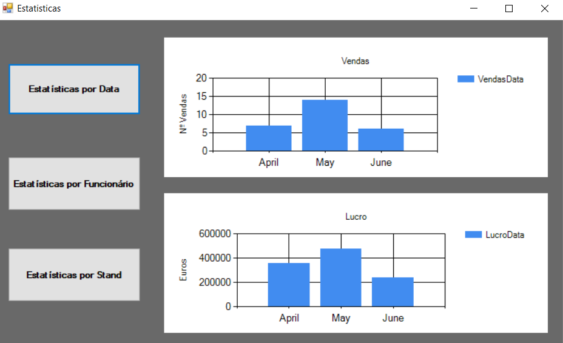
<br>

Na secção de estatísticas o utilizador pode ver o número de vendas e as receitas por mês, funcionário e Stand.
Implementámos algumas Views para representar essa informação:

```sql
CREATE VIEW RevenueByMonth AS
SELECT DATENAME(MONTH, venda.data_venda) AS month_name,
 MONTH(venda.data_venda) AS month_number,
    SUM(venda.montante) AS total_montante
FROM venda
GROUP BY DATENAME(MONTH, venda.data_venda), MONTH(venda.data_venda);
```

...

## Normalização

Não achamos necessário efetuar algum tipo de normalização.

## Índices

Depois de analisar as queries mais frequentes, decidimos criar os seguintes índices:

```sql
CREATE INDEX aluga_datas ON aluguer (data_fim, data_inicio);
CREATE INDEX func_name ON funcionario (nome);
CREATE INDEX client_name ON cliente (nome);
```

## SQL Programming: Stored Procedures, Triggers, UDF

[SQL SPs](../source/SQL_Scripts/Stored_procedures.sql "SP")
<br>

[SQL UDFs](../source/SQL_Scripts/User_defined_functions.sql "UDF")
<br>

[SQL Triggers File](../source/SQL_Scripts/Triggers.sql "Triggers")

### Dados iniciais da dabase de dados

[Indexes File](../source/SQL_Scripts/SQL_DML.sql "DML")

## Outras notas/Other notes

O ficheiro [Drop Tables](../source/SQL_Scripts/Drop_tables.sql "DML") permite apagar todas as tabelas da base de dados. Para ter a base de dados com todas as configurações iniciais, basta correr os seguintes ficheiros:

1. [DDL](../source/SQL_Scripts/SQL_DDL.sql "DDL")
2. [Triggers](../source/SQL_Scripts/Triggers.sql "Triggers")
3. [Views](../source/SQL_Scripts/Views.sql "Views")
4. [User Defined Functions](../source/SQL_Scripts/User_defined_functions.sql "UDF")
5. [Stored Procedures](../source/SQL_Scripts/Stored_procedures.sql "SP")
6. [Indexes](../source/SQL_Scripts/Indexes.sql "Indexes")
7. [DML](../source/SQL_Scripts/SQL_DML.sql "DML")

Logins a utilizar:

- Username: `admin` Password: `admin`
- Username: `user` Password: `user`

Modificação de utilizador de BD em todos os ficheiros `.cs` com a seguinte função:

```csharp
private SqlConnection getSGBDConnection()
```
