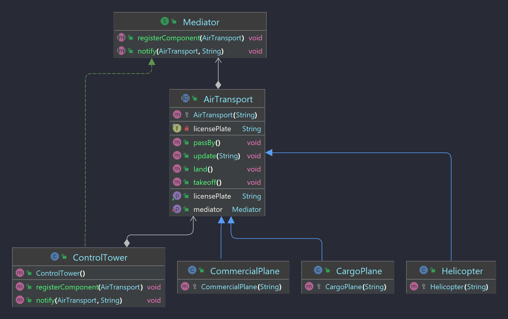

# Ex3

## Problema

Vários veiculos aéreos precisam de divulgar e obter informação sobre outros veículos ao seu redor.

Como existem sempre vários veiculos diferentes, com características diferentes (e com tecnologias de comunicação possivelmente incompativeis entre eles) , é necessário haver um middle-man, i.e um mediador. O mediador poderá controlar o tráfego geral do aeroporto e os veiculos são abstraídos disso.

## Solução

Foi implementado o padrão *Mediator*, uma ControlTower que recebe mensagens e as redireciona.

## Referências

- Slides Teóricos
- [Refactoring Guru](https://refactoring.guru/design-patterns/mediator)
