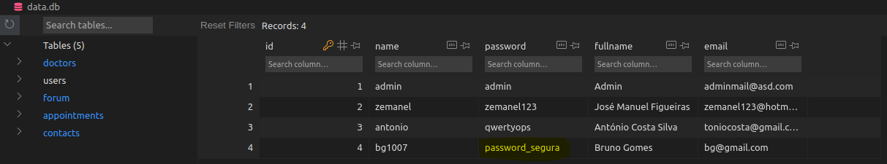
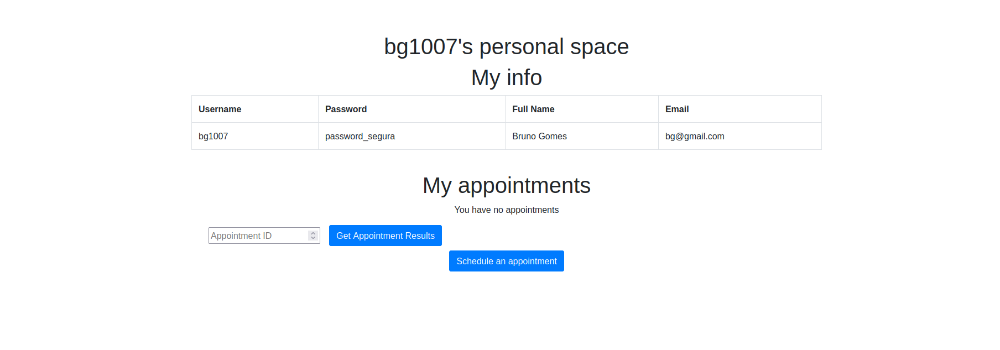
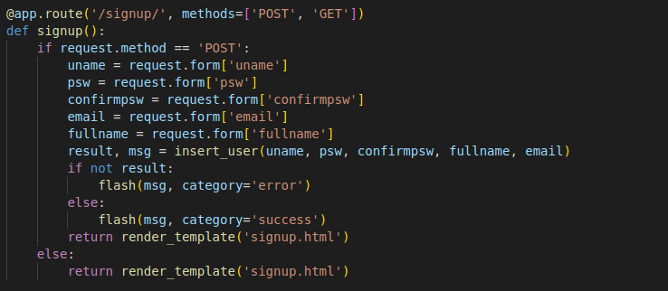
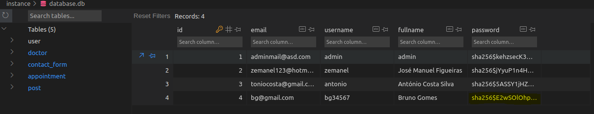
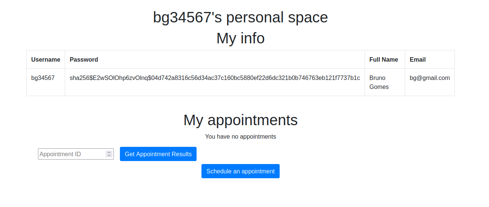
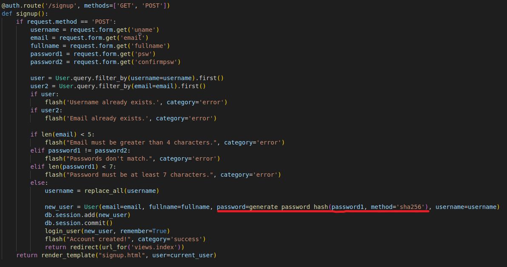

# CWE-256 (Plaintext Storage of a Password)

This vulnerability allows attackers to obtain the password of existing accounts on the website.

This vulnerability puts both the system and users at risk. Obviously, having a hacker able to find and read every single password used to access a system would be a disaster. They could simply find a user with administrator credentials and compromise the entire system or site.

In order to fix this vulnerability, the stored password must be encrypted before being stored in the database. This way, even if the database is compromised, the passwords will be unreadable.

We decided to use SHA-256 algorithm to encrypt the passwords. This algorithm is considered very secure and is widely used at the time of this writing.

## Unsafe version

This screenshot was taken right after a sign up. As we can see, nothing is encrypted in this data base.

In this next image, we can see the code responsible for storing the password in the database. As we can see, the password is stored in plain text.

## Safe version

After creating a new account, we can immediately see that the password is encrypted.

In the next image, we can see our safe algorithm, which already restricts the user's actions, and encrypts the password entered with the hash function "SHA-256".

 
