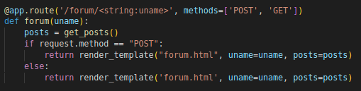
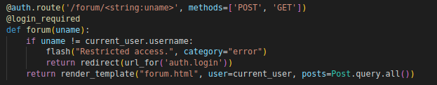

# CWE - 425 (Direct Request ('Forced Browsing'))

The web application does not adequately enforce appropriate authorization on all restricted URLs, scripts, or files.

## How to reproduce

1. Change URL to a restricted page e.g <http://127.0.0.1:8000/user_area/admin>

## How to fix

1. Add a decorator to the restricted pages (@login_required) and check if the user in the URL is the same as the cached user (`current user`).

