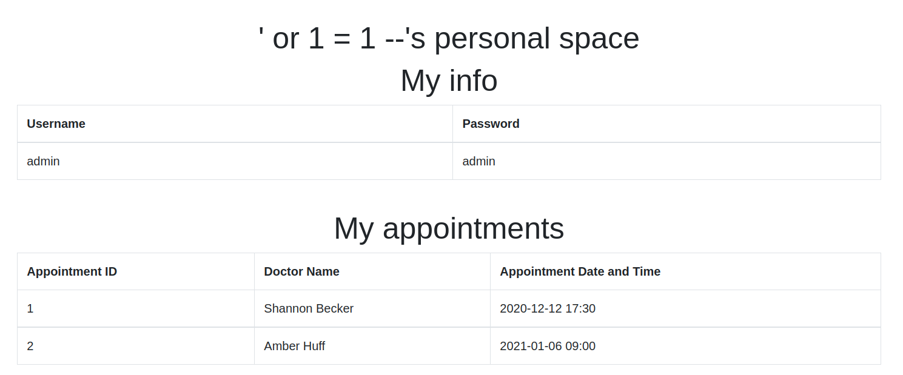
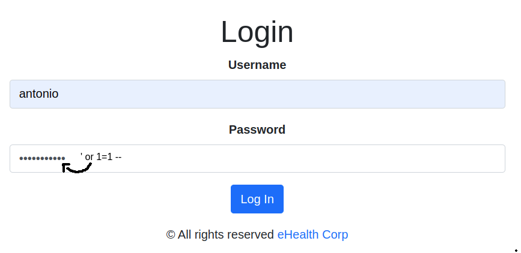

# CWE-89: Improper Neutralization of Special Elements used in an SQL Command ('SQL Injection')

The application does not properly neutralize or incorrectly neutralizes user-controllable input before it is placed in output that is used as a SQL command

## How to reproduce

1. Go to the login page and insert the following string in username or password input field: `' OR 1=1 --`

2. Click on the login button

3. The login will be successful

Of course we can input any other sql code. For example, `'; DROP TABLE users; --` will eliminate the users table, `'; UPDATE doctors SET password ='hacked' WHERE id = 1--` will change the password of the first doctor to `hacked` and so on.

This is fixed in the secure version of the app by creating a list of forbidden characters and creating a function to replace those characters with safe ones that won't execute SQL code.

# CWE-89: Improper Access Control

The aplication does not restrict or incorrectly restricts access to a resource from an unauthorized actor.

One could use `' OR 1=1 --` in the password field and you will be able to login in the username's account.

By doing that the person has now all access to the user information and can even print certifications

