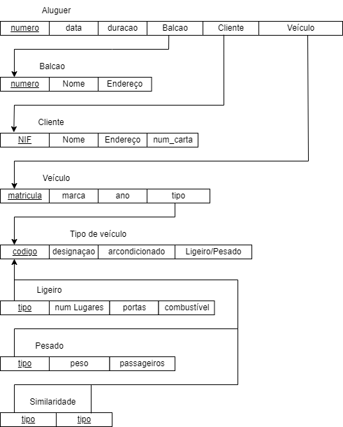
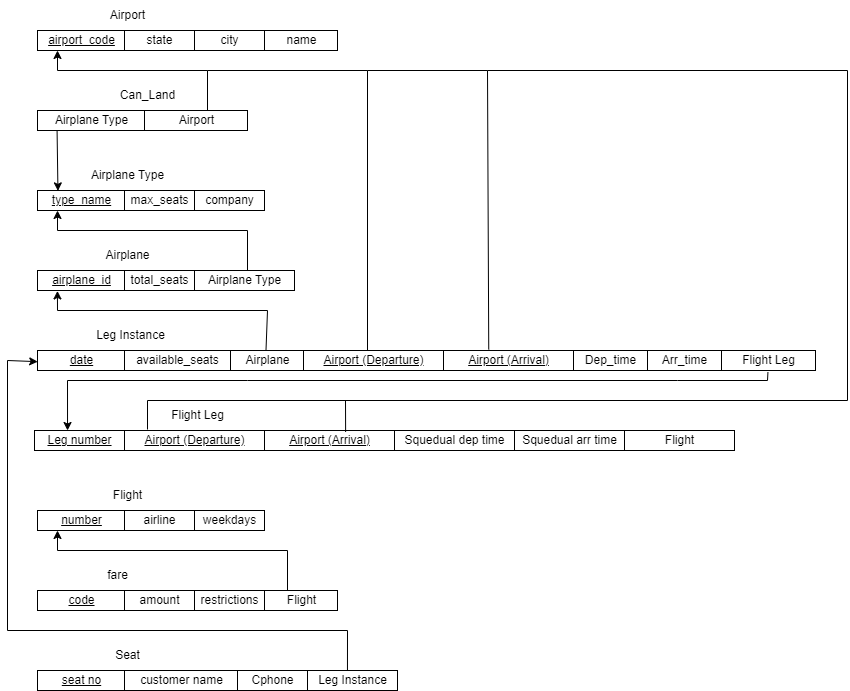
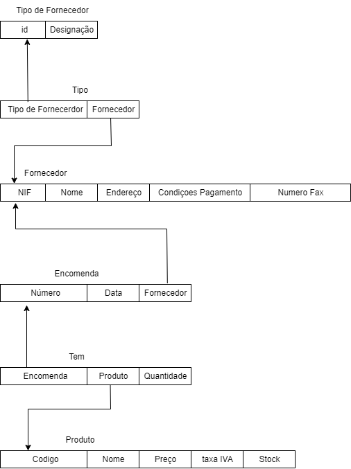
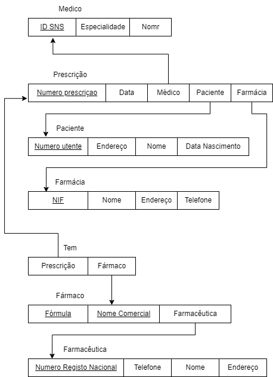
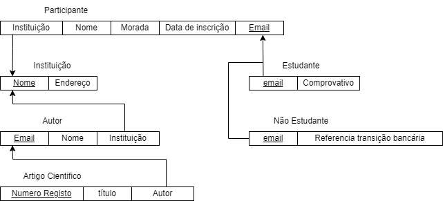
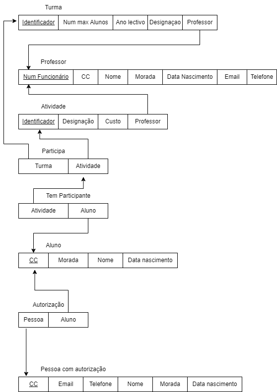

# BD: Guião 3


## ​Problema 3.1
 
### *a)*

```
Relações(tabelas):
 -Aluguer
 -Balcao
 -Cliente
 -Veiculo
 -Tipo_Veículo
 -Similaridade
 -Ligeiro
 -Pesado
 
Esquema de relação:
 -Aluguer(numero, data, duracao, Balcao, Cliente, Veiculo)
 -Balcao(numero, nome, endereco)
 -Cliente(NIF, nome, endereco, numero_carta)
 -Veiculo(matricula, marca, ano, tipo)
 -Tipo_Veículo(codigo, designacao, arcondicionado, ligeiro/pesado)
 -Similaridade(tipo1, tipo2)
 -Ligeiro(tipo, lugares, portas, combustivel)
 -Pesado(tipo, peso, passageiros)
```


### *b)* 

```
Chaves Primarias:
 -Aluguer -> numero
 -Balcao -> numero
 -Cliente -> NIF
 -Veículo -> matricula
 -Tipo_Veíuclo -> codigo
 -Pesado -> tipo
 -Ligeiro -> tipo

Chaves Estrangeiras:
 -Aluguer -> numero(Balcao), NIF(Cliente), matricula(Veículo)
 -Veículo -> codigo(Tipo_Veículo)
 -Pesado -> codigo(Tipo_veículo)
 -Ligeiro -> codigo(Tipo_Veículo)
 -Similaridade -> codigo(Tipo_Veículo)
 
Chaves Candidatas:
 -Balcao -> nome
 -Cliente -> num_carta
```


### *c)* 




## ​Problema 3.2

### *a)*

```
Relações(tabelas):
 -Airport
 -Flight_Leg
 -Can_Land
 -Airplane_Type
 -Airplane
 -Leg_Instance
 -Flight
 -Fare
 -Seat
 
Esquema de relação:
 -Airport(airport_code, state, city, name)
 -Flight_Leg(Airport(departure), Airport(arrival), squedual_dep.time, squedual_arr.time, Leg_instance, Flight)
 -Can_Land(Airplane_type, Airport)
 -Airplane_Type(type_name, max_seats, company)
 -Airplane(airplane_id, total_seats, Airplane_Type)
 -Leg_Instance(date, available_seats, Airplane, Airport(departure), Airport(arrival))
 -Flight(number, state, city, name)
 -Fare(code, amount, restrictions, Flight)
 -Seat(seat_number, customer_name, Cellphone, )
```


### *b)* 

```
Chaves Primarias:
 -Airport -> airport_code
 -Can_Land -> type_name(Airport), airport_code(Airplane_Type)
 -Airplane_Type -> type_name
 -Airplane -> airplane_id
 -Flight_leg -> Leg_number
 -Flight -> number
 -Fare -> code
 -Leg instance -> Date,Flight_number,leg_no
 -Seat -> Seat_number
 

Chaves Estrangeiras:
 -Airplane -> Airplane_Type
 -Can_Land -> type_name(Airport), airport_code(Airplane_Type)
 -Flight_leg -> number(Flight), leg_no(Flight Leg), airport_code(Departure Airport), airport_code(Arrival Airport)
 -Fare -> number(Flight)
 -Leg_instance -> airplane_id(Airplane), airport_code(Departure Airport), airport_code(Arrival Airport), leg no (Flight Leg)
 -Seat -> Date (Leg instance),Flight_number(Leg instance), leg_no(Leg instance)
 
 
Chaves Candidatas:
 -Airport -> name
 -Seat-> customer_name
 
```


### *c)* 




## ​Problema 3.3


### *a)* 2.1



### *b)* 2.2



### *c)* 2.3



### *d)* 2.4

