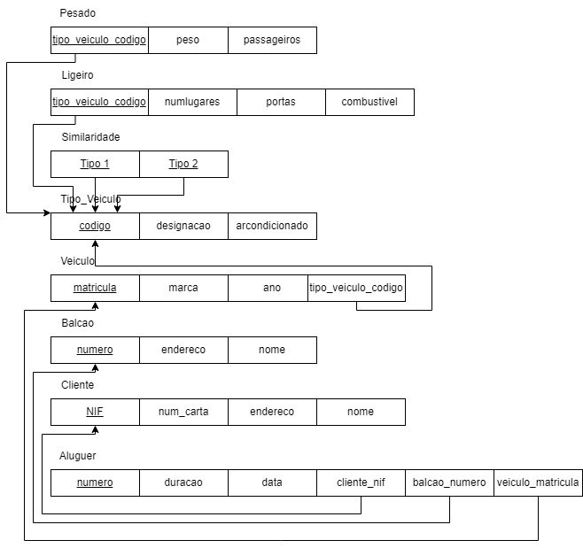

# BD: Guião 3


## ​Problema 3.1
 
### *a)*

```
Cliente(NIF, num_carta, endereço, nome)
Aluguer(numero, duracao, data, cliente_nif, balcao_numero, veiculo_matricula)
Balcao(numero, endereço, nome)
Veiculo(matricula, marca, ano, tipo_veiculo_codigo)
Tipo_veiculo(codigo, designacao, arcondicionado)
Similaridade(tipo1, tipo2)
Ligeiro(tipo_veiculo_codigo, numlugares, portas, combustivel)
Pesado(tipo_veiculo_codigo, peso, passageiros)
```


### *b)* 

```
Cliente: Chaves candidatas: NIF, num_carta. Chaves primárias: NIF. Chaves estrangeiras: -
Aluguer: Chaves candidatas: numero. Chaves primárias: numero. Chaves estrangeiras: cliente_nif, balcao_numero, veiculo_matricula.
Balcao: Chaves candidatas: numero, endereço. Chaves primárias: numero. Chaves estrangeiras: -
Veiculo: Chaves candidatas: matricula. Chaves primárias: matricula. Chaves estrangeiras: tipo_veiculo_codigo.
Tipo_veiculo: Chaves candidatas: codigo. Chaves primárias: codigo. Chaves estrangeiras: -
Similaridade: Chaves candidatas: tipo1, tipo2. Chaves primárias: tipo1, tipo2. Chaves estrangeiras: tipo1, tipo2
Ligeiro: Chaves candidatas: tipo_veiculo_codigo. Chaves primárias: tipo_veiculo_codigo. Chaves estrangeiras: tipo_veiculo_codigo
Pesado: Chaves candidatas: tipo_veiculo_codigo. Chaves primárias: tipo_veiculo_codigo. Chaves estrangeiras: tipo_veiculo_codigo
```


### *c)* 




## ​Problema 3.2

### *a)*

```
... Write here your answer ...
```


### *b)* 

```
... Write here your answer ...
```


### *c)* 


## ​Problema 3.3


### *a)* 2.1


### *b)* 2.2


### *c)* 2.3


### *d)* 2.4

