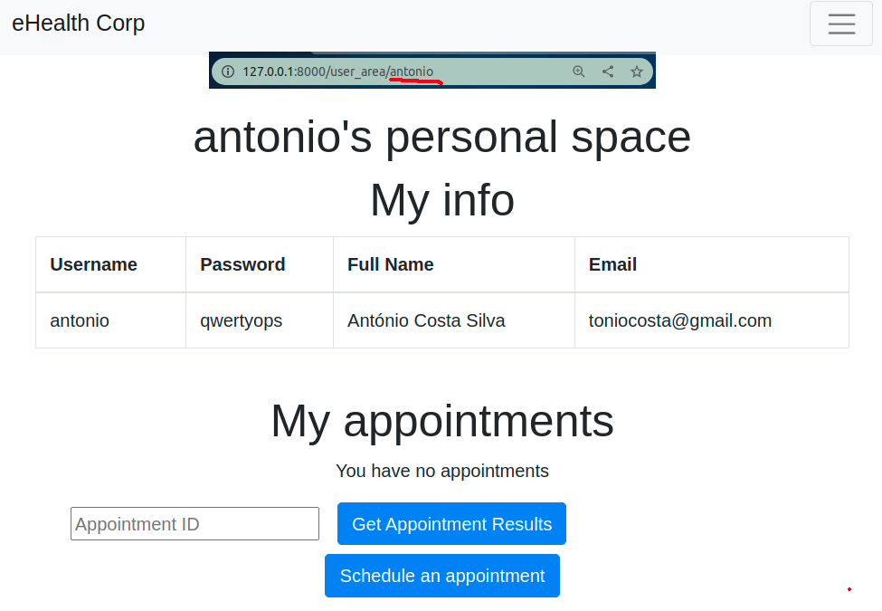
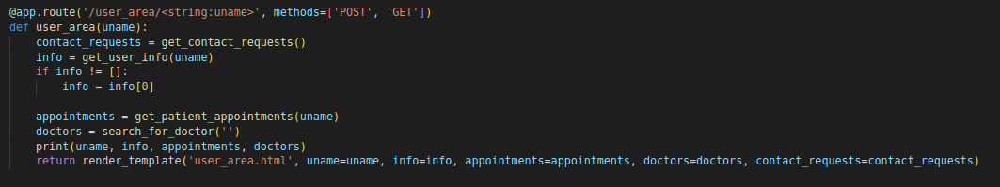
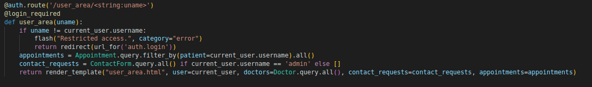

# CWE - 200 (Exposure of Sensitive Information to an Unauthorized Actor)

The product exposes sensitive information to an actor that is not explicitly authorized to have access to that information.

## How to reproduce

1. Go to user area and change the page url to existing user (ex: http://127.0.0.1:8000/user_area/**admin** or http://127.0.0.1:8000/user_area/**antonio**)

2. You get redirected to the user area of the inserted user

This happens because the app doesn't require you to be logged in to access others account.

This vulnerability gets fixed in the secure version using the flask decorator `@login_required`

