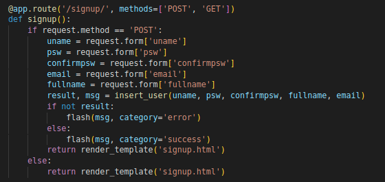
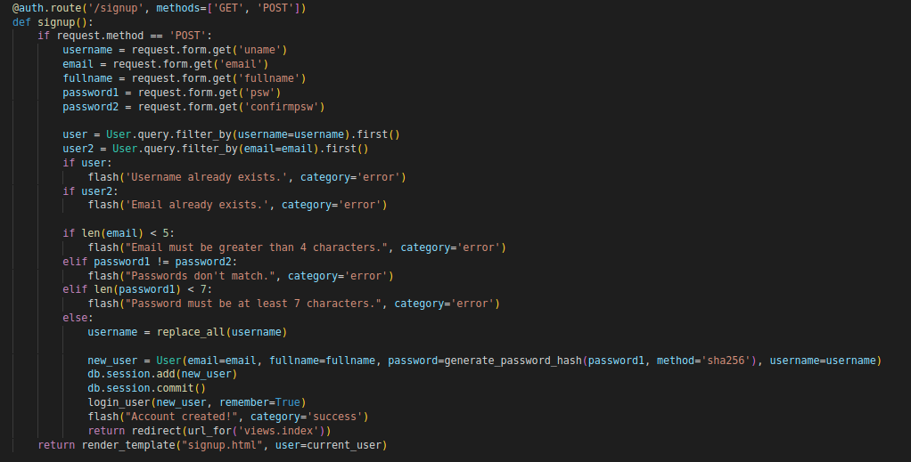

# CWE - 521 (Weak Password Requirements)

The product does not require that users should have strong passwords, which makes it easier for attackers to compromise user accounts.

In this case we made new requirements that must be met in order to create an account. Of course we could have added more requirements, but we believe that the intention is there and we didn't want to make the testing of the site tiresome.

# CWE - 20 (Improper Input Validation)

The product receives input or data, but it does not validate or incorrectly validates that the input has the properties that are required to process the data safely and correctly.

We should restrict some special characters to the username since it is going to appear in some URL's and so, it shouldn't have any special characters.

In the secure code, we use the function `replace_all()` which replaces any special characters in the username for different ones. We could ask the client to use another username but we decided to do it this way in order to show the various outcomes for the two versions of the code.
