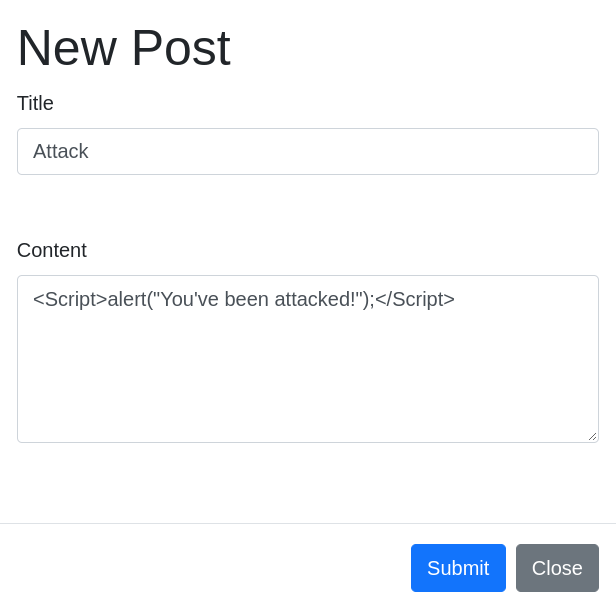
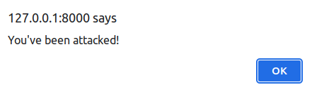
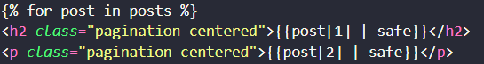

# CWE-79: Improper Neutralization of Input During Web Page Generation ('Cross-site Scripting')

The application does not properly neutralize or incorrectly neutralizes user-controllable input before it is placed in output that is used as a web page that is served to other users.

## How to reproduce

1. Go to the forum page and insert the following string in title or content input field: ``

2. Click on the post button

3. The alert will appear

This is because the server is not sanitizing the input before sending it to the client. This is fixed natively within flask/jinja2 by **not** using the `| safe` filter. This is not the case for the other vulnerabilities.

