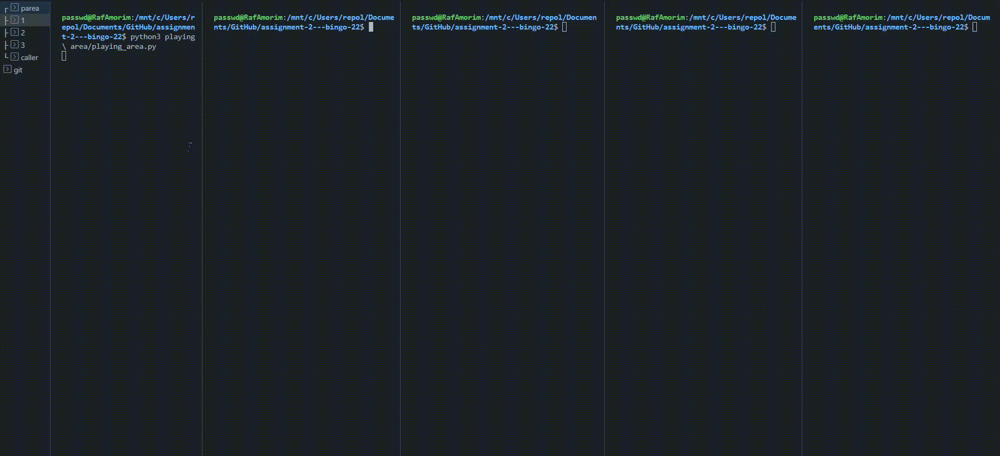
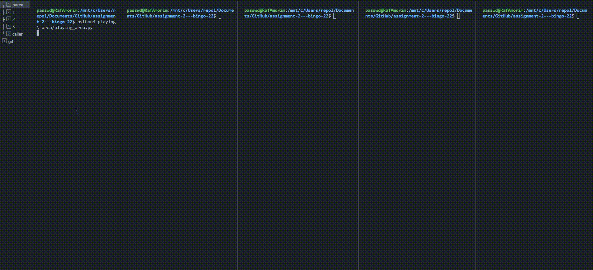

# Project 2 - Secure Game

## Introduction

Project carried out in the scope of the subject Security of Information and Organizations with the purpose of implementing a secure game through sockets and cryptography.

## Description

This assignment will focus on the implementation of a robust protocol for handling a distributed game. The game under study will be Bingo, which is a game of chance.

Implementation will consist of a server (caller) and multiple clients (players) communicating over a secure network (playing area).

## How to Run

1. Create a virtual environment:

```bash
python3 -m venv venv
```

2. Activate the virtual environment (this step is necessary for each new terminal session):

```bash
source venv/bin/activate
```

3. Install the requirements:

```bash
pip install -r requirements.txt
```

***You'll also need to install the [PTEID Software](https://www.autenticacao.gov.pt/cc-aplicacao).***

4. Make sure you have a card reader connected with your citizen card.

5. Firstly, get the playing area running:

```bash
python3 playing\ area/playing_area.py # linux path
```

6. Then, you may run however many players you want, or the caller just once:

```bash
python3 player/player.py # linux path

python3 caller/caller.py # linux path
```

*You may be prompted to enter your citizen card PIN, if running on main branch. This step is necessary for the registration process.*

7. The caller must start the game by typing `y` in the terminal and then, press enter in the playing_area to advance in the game, stage by stage.

**Warning:** You must either run the files from this relative location or inside the caller/player/playing area folders, or else the imports will fail.

## Report

### Flow of the game

#### **General explanation**

The playing area acts as a lobby for the game, and as such, it must be executed first. It is responsible for handling the registration of users, the distribution of user information, the deck to be shuffled, player cards, final deck, bans administered by the caller, bingo results and lastly, the audit log. It acts as a relay for messages between the caller and the players.

#### **Registration**

In order for the game to start, there has to be at least a caller and a player connected to the playing area.

Each entity can configure what port and IP to connect to by running with the optional arguments `--ip` and `--port`. If no arguments are provided, the default values are 127.0.0.1 and 5000, respectively. The caller may alter the deck size by running with the optional argument `--decksize`, which defaults to 16.

The playing area is the entity that handles user registration. The registration protocol goes as follows:

1. The user generates a key pair and sends a registration request to the playing area, which contains only the public key, as to make possible the encryption of further conversations. The playing area sends its public key back to the user. **All messages from here on out are encrypted and signed**.

2. The user sends its citizen card certificate to the playing area, which is then verified when the playing area sends back a nonce for the user to sign. If the validation of the citizen card signature fails and the user can't prove its identity, the user is rejected. Otherwise, the registration is allowed to continue.

3. The playing area checks if the game is already ongoing. If it is, the user is rejected. If the citizen card's signature is invalid, the user is also rejected. Otherwise, we check if the user is of type caller or player. If it is the former, and there is already an existing caller, the user is rejected.

4. On success, the user is added to the dictionary of registered users, with a given id as key, as an object of class `Player` or `Caller`, both of which inherit from the class `Client`.

#### **Game Start**

Upon game start, ordered by the caller, the playing area must distribute all available user information to everyone. This includes user id, user name, user type and user public key. Players who receive this packet must, in return, send their generated card to the playing area.

Players can detect if the cards are faulty, but they do not leave the game, as instead, they wait for a caller message stating the player was banned.

At the end of this process, the playing area will distribute each player's card to all users.

#### **Deck Shuffling**

After distributing the cards, the playing area warns the caller to generate the initial deck. This deck is sent to the playing area, which in return, distributes it to all players, by order of registration. Each user then generates a symmetric key, used to encrypt the deck. It is shuffled and sent back to the playing area.

Upon receiving a faulty deck, **players** can decide to leave the game. If such happens, the playing area will warn everyone of it. If the **caller** receives a faulty deck, it will be rejected and the game will be aborted. The playing area will then warn everyone of the game abort.

#### **Symmetric encryption**

When the playing area receives the deck from the last player, it sends it to all users. In return, each user sends the symmetric key used in the last stage to encrypt the deck, so the playing area can broadcast it to everyone.

After key sharing, all users have the means required to decrypt the final deck. The decryption is done by order of registration, starting with the last player to receive the deck, and ending with the caller.

Each user reaches the same plaintext deck, which is chosen as the final deck.

#### **Bingo Calculation**

All users calculate the bingo results and the players send them to the caller. The caller then compares these results with his own results and bans any dishonest players. The caller calculates the bingo results again if any players were banned, and then sends them to everyone.

#### **Audit Log**

Users may request the audit log from the playing area. The playing area will then send the log to the user, which will then be printed to the terminal.

### Implementation

#### **Asymmetric encryption**

All users and playing area use hybrid RSA AES encryption to communicate. The public key is shared during registration, as stated before.

We decided to choose this particular encryption method, because the data size to encrypt was much bigger than the 2048 bit size of the RSA key, and so, traditional RSA encryption would not be efficient at all, encrypting chunk by chunk.

Hybrid encryption combines the speed of symmetric encryption with the security of asymmetric encryption. The symmetric key is used to encrypt the message because it is much faster than asymmetric encryption, but the symmetric key itself is encrypted using asymmetric encryption to ensure that it is secure while in transit. This way, the message can be transmitted quickly, while still being secure.

The auxiliary methods created for this purpose are present in the `asymmetric.py` file where we make use of the `hybrid_rsa_aes` and `cryptography.hazmat` libraries. In `main()` we can see a traditional Bob-Alice example.

In `utils.py`, `send_message()` actually takes the data to be sent and the socket address, signs it with the sender's private key and encrypts it with the receiver's public key, and sends it to the socket address. All messages have the id of the sender appended to it, so that the playing area can identify the sender, and correctly decrypt it.

We can also find `recv_message` which receives the data from the sender, decrypts it with the receiver's private key and verifies the signature with the public key of the sender.

#### **Symmetric encryption**

In order to encrypt and decrypt the decks, we use the AES algorithm in CBC mode, making use of the `cryptography.hazmat` library. We use CBC mode, because it is more secure than ECB mode, despite being more difficult to implement, since initializing vectors are used, which make symmetric key sharing harder.

The auxiliary methods created for this purpose are present in the `symmetric.py` file, where we can find a usage example in `main()`.

#### **Citizen Card**

The `PyKCS11` library is a Python wrapper for PKCS#11, which is a standard that defines how to interact with devices, such as smart cards or hardware security modules (HSMs). These devices often hold keys and certificates that can be used for tasks such as **encryption**, **signing**, and **authentication**.

The script starts by importing several libraries that are used throughout the code. The `PyKCS11` library is used to interact with the smart card or HSM, and the cryptography library is used for various cryptographic operations.

The `initPkcs()` function initializes the `PKCS#11` library and opens a session with a smart card reader. The `login()` function prompts the user to enter a PIN and logs in to the smart card using that PIN.

The `getName()` function retrieves the user's name from the smart card. The `getCerts()` function retrieves the user's authentication certificate from the smart card. The `cert_to_string()` and `cert_from_string()` functions are used to convert the certificate to and from a base64-encoded string.

The `signCC()` function uses the private key on the smart card to sign a message. The `verifySign()` function uses the public key from the certificate to verify the signature.

#### **Audit Log**

A class `MyLogger` was created to properly log all the events, as required. It is used in the `playing_area.py` file, where we can see that it logs registration and action events. A `.log` file is created after the first user registers. The first entry does not have the field `hash(prev_entry)`. The hashing algorithm used is SHA256. The `signature` field contains the signature of the data received in the particular logged event.

When the game ends, the audit log is sent to the user who requested it. The user then prints it to the terminal. After every user making the choice, the log is cleared, along with the clients' local information. Users are now able to join a new game.

#### **Cheating**

The actions of generating decks, shuffling decks, generating cards and obtaining bingo results have a **1 in 30** probability of misbehaving/cheating.

The playing area does not detect if any cheating has occurred.
The players can detect if cards, decks or signatures are faulty, but they do not have the permissions to abort a game on their own. They can only leave the game, and the playing area will warn everyone of it. They also do not leave the game on detection of card cheating.

The caller can, however, ban players or abort the game if need be. If the caller detects a faulty deck or signature, it will be rejected and the game will be aborted. The playing area will then warn everyone of the event. When players are instead banned, the playing area makes sure to inform everyone of it, so they can update their local information.

For this purpose, `utils.py` has functions `validate_deck_enc()`, `validate_card()`, `generate_card()` and `generate_deck()` with embedded cheating chances. Callers have `act_upon_signature_validity_as_caller()` and players have `act_upon_signature_validity_as_player()`. Only the players are able to cheat in the process of generating bingos, where they can add their own id to the bingo results list in case of absence.

#### **Tests**

The main branch supports Citizen Card integration and the branch [no-cc](https://github.com/detiuaveiro/assignment-2---bingo-22/tree/no-cc) does not. This branch makes it easier for repeating tests, without the need of a citizen's card.

The caller must start the game by typing `y` in the terminal and then, press `enter` in the playing_area to advance in the game, stage by stage.

Terminal output colors:

- Yellow for received information.

- Red for failure or losing the game.

- Green for validity success or winning the game.

- Blue for own information.

If you wish to enable more frequent cheating, you can do so by changing the chance in `traquinices` in `utils.py`.

#### **Version Without Cheats**


#### **Version With Citizen Card**


#### **Version With Invalid Deck in Caller**



#### **Version With Invalid Deck in Player**



#### **Version With Invalid Card**


## Conclusion

The game relies not only on confidential and authenticated, secure communications between entities, but also on reliable protocols for eventual cheating in order to win the game. Despite all the difficulties faced, the group managed to develop and finish all the functionalities and implementations mentioned in the project's statement to guarantee security and trust to the players. We got a more in depth understanding of the concepts and technologies involved in the development of a secure application, and we are confident that we will be able to apply this knowledge in future projects.

## Authors

| Nº Mec.   | Name                                              | Email               |
| :---:     | :---:                                             | :---:               |
| 65081     | [Rui Machado](https://github.com/RuiMachadoUA)    | ruimmachado@ua.pt   |
| 98197     | [Rafael Amorim](https://github.com/Raf4morim)     | rafael.amorim@ua.pt |
| 103440    | [Marco Almeida](https://github.com/marco-almeida) | marco.almeida@ua.pt |
| 104110    | [Tiago Alves](https://github.com/Tiago-AlvesUA)   | tiagojba9@ua.pt     |
